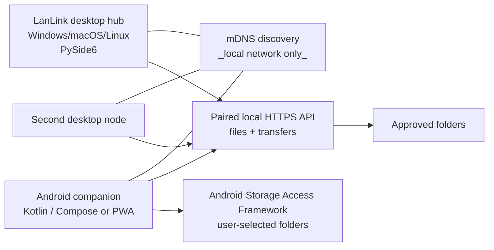

# LanLink Hub — MVP scaffold

LanLink Hub is a private, local-network file-sharing hub for your own laptops and phones. It is deliberately designed around **explicit shares** and **device pairing**, rather than making an entire computer visible on Wi-Fi.

This repository is a working early scaffold, not a finished sync product. It runs a small API on each participating computer and includes a PySide6 desktop window to choose shared folders. A phone can pair by opening the shown LAN URL in its browser, entering the six-digit code, and then browse, download, and upload files.

## What this MVP does

- Lets a user choose the exact folders to share; paths outside those folders are rejected.
- Runs a local FastAPI service on port `8765`.
- Advertises and discovers LanLink services on the local Wi-Fi/hotspot through mDNS (`_lanlink._tcp.local`).
- Uses a short-lived, six-digit pairing code to issue one high-entropy token per phone/computer.
- Supports folder listing, download, upload, and copy/move **between folders shared by the same node**.
- Provides a responsive, browser-based client suitable for an Android phone today.
- Shows paired devices and nearby LanLink computers in the desktop Devices tab.
- Includes a reusable Python client for the next transfer engine.

It intentionally does **not** share whole disks, discover files without permission, transfer between two remote nodes automatically, or expose any internet-facing relay.

## Recommended product shape



Each installed LanLink node has two roles:

1. **Share service** — makes only approved folders available through an authenticated local API.
2. **Hub interface** — discovers paired nodes and coordinates remote-to-remote transfers. For a remote copy, the initiating hub streams from the source node to the destination node; it should avoid placing a full second copy on the hub's disk.

For Android, a native Kotlin/Jetpack Compose client is the practical long-term choice. It can use Android's Storage Access Framework so the user chooses which folders or media the app can access. The included mobile web interface is a low-friction first client; it also works well as a pairing and browsing fallback.

## Requirements and decisions

| Need | MVP decision | Production evolution |
| --- | --- | --- |
| Same-network/hotspot discovery | mDNS service advertisement; manual LAN URL fallback | Keep mDNS and add UDP broadcast only where mDNS is unavailable |
| Link a new device | Code displayed on the sharing computer | QR code with a one-time signed pairing invitation |
| Browse files | REST list endpoint scoped to shares | Virtual device/share tree with search and recent files |
| Copy/move | Safe local-share copy/move endpoint | Resumable, checksum-verified streaming job between nodes |
| Phone access | Responsive web client now | Native Android app with SAF and background transfer notifications |
| Remote-folder access | API-backed virtual folders in LanLink | Optional OS integration: WebDAV mount or native virtual filesystem, read-only by default |

## Security model

The core rule is: **network membership is not authorization**.

- A computer only exposes folders the owner has added.
- Every browser/app must pair with the currently displayed code. The code expires after 10 minutes and a successful pairing receives a separate random token.
- API calls require `X-LanLink-Token`; tokens are stored per paired device and can be revoked from the desktop **Devices** tab.
- Every path is canonicalized and verified to remain within the chosen shared root. `..` traversal and absolute paths are refused.
- Uploads cannot overwrite an existing file. Copy/move likewise refuses accidental overwrite.
- Discovery messages contain identity/endpoint metadata only—never files, folder names, pairing codes, or tokens.

### Important MVP limitation

This prototype uses HTTP because it is meant for a **trusted home hotspot/LAN while being developed**. The pairing token travels over that network, so do not use it on a public, hotel, school, or unknown Wi-Fi network.

Before calling this a production app, replace the pairing exchange with a QR-based authenticated key exchange and TLS (or a Noise protocol), pin each paired device's public key, encrypt tokens at rest using the OS credential store, and add transfer manifests with SHA-256 verification and resume support.

## Run it on Windows

Open a terminal in this project folder. Use the instructions for the terminal you opened.

### PowerShell

```powershell
py -3 -m venv .venv
.\.venv\Scripts\Activate.ps1
python -m pip install --upgrade pip
python -m pip install -e ".[dev]"
python -m lanlink.desktop
```

The prompt should begin with `(.venv)`. If PowerShell blocks the activation script, launch the app directly after creating the environment:

```powershell
.\.venv\Scripts\python.exe -m pip install -e ".[dev]"
.\.venv\Scripts\python.exe -m lanlink.desktop
```

### Command Prompt (`cmd.exe`)

The `.ps1` activation command is for PowerShell and will not activate a Command Prompt. In `cmd.exe`, use `activate.bat`:

```bat
py -3 -m venv .venv
.venv\Scripts\activate.bat
python -m pip install --upgrade pip
python -m pip install -e ".[dev]"
python -m lanlink.desktop
```

The prompt should begin with `(.venv)`. Using `python -m lanlink.desktop` also avoids the common Windows problem where the `lanlink-hub.exe` script is installed in a Scripts folder that is not on `PATH`.

Then:

1. Select **Add shared folder** and choose a test folder, such as a folder containing non-sensitive files.
2. Connect the phone and computer to the same Wi-Fi network or phone hotspot.
3. On the phone, open the URL displayed in LanLink Hub (for example `http://192.168.1.18:8765`).
4. Enter the six-digit code shown in the desktop window.
5. Browse a shared folder, download a file, or upload a file into the open folder.
6. Open the **Devices** tab in the desktop app to see paired phones/computers and revoke access if needed.

If another computer is running LanLink on the same network, it should appear under **Nearby LanLink devices**. Select it and choose **Open selected device** to pair with that computer's sharing page. Mobile browsers can connect to LanLink, but they cannot advertise themselves through mDNS; a native Android app is the right next step for phone-to-computer discovery.

Windows may ask whether Python can communicate on private networks. Allow **Private networks** only. If the phone cannot open the URL, confirm that both devices are on the same hotspot and that the Windows network profile is **Private**. mDNS discovery is helpful but optional: the URL is the reliable fallback.

For a headless sharing node, use:

```powershell
python -m lanlink.server --share "C:\Users\YourName\Documents\LanLink Share"
```

Run the checks with:

```powershell
python -m pytest
```

## API surface in this scaffold

| Endpoint | Use |
| --- | --- |
| `POST /v1/pair` | Exchange the visible pairing code for a device token |
| `GET /v1/shares` | List approved shares |
| `GET /v1/shares/{id}/list?path=` | Browse a folder inside a share |
| `GET /v1/files/{id}?path=` | Download one file |
| `POST /v1/uploads/{id}?path=` | Upload a file without overwriting existing files |
| `POST /v1/operations` | Copy or move a file between two local shares |

All endpoints other than pairing and `/health` require the `X-LanLink-Token` header.

## Milestones from here

1. **MVP hardening (1–2 weeks):** add QR pairing, friendlier network/error states, thumbnails, transfer progress/cancel, tests for uploads/API, and a signed Windows build.
2. **Cross-device transfers (2–4 weeks):** browse remote paired nodes from the desktop UI; stream source-to-destination transfers with progress, checksums, pause/resume, conflict names, and audit history.
3. **Android companion (3–5 weeks):** Kotlin/Compose client with QR pairing, foreground transfer service, SAF file picker, download destination selection, and optional camera scanning.
4. **Production security/reliability:** TLS/key pinning, OS credential storage, per-share permissions (read/upload/delete), encrypted transfer manifests, rate limits, retention controls, and recovery after network changes.
5. **Optional convenience layer:** read-only WebDAV or OS virtual folder integration behind an explicit opt-in; avoid automatically mapping drives or persisting credentials without a clear user choice.

## Project layout

```text
src/lanlink/
  api.py        local paired-file API
  client.py     reusable client used by future desktop/Android peers
  desktop.py    PySide6 sharing window
  discovery.py  mDNS advertisement and nearby-device browsing
  files.py      share-root safety and file operations
  server.py     background service and headless entry point
  state.py      persisted shares, pairings, and expiring pairing code
  static/       responsive phone browser client
tests/          traversal and file-operation checks
```
